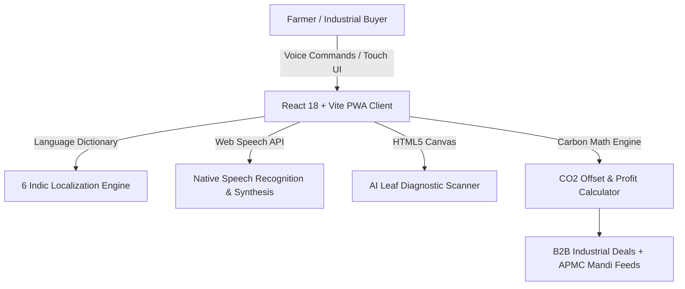

# 🌾 Agri-Bridge (AgroSmart)
> **AI-Enabled Multilingual Circular Economy Platform for Smallholder Farmers**

[](https://reactjs.org/)
[](https://vitejs.dev/)
[]()
[]()
[]()
[]()

---

## 📌 Executive Summary

Open-field agricultural residue burning (stubble burning) releases over **149 million tonnes** of crop residue smoke into India's atmosphere annually, worsening winter smog and depleting topsoil nutrients. Simultaneously, smallholder farmers lose **25%–40%** of their market earnings to predatory middlemen due to price opacity and digital literacy barriers.

**Agri-Bridge** bridges this gap by introducing a **decentralized B2B circular economy marketplace** connecting farmers directly with industrial bioenergy, paper, and packaging plants, while removing digital literacy friction through a **hands-free Voice AI interface** available in **6 Indic languages**.

---

## 🚀 Key Features

### 1. 🌾 P2P Biomass Circular Marketplace
* **Direct B2B Stubble Trade**: Farmers list surplus crop residue (paddy straw, sugarcane bagasse, cotton stalks, coconut husk) directly for industrial buyers.
* **Automated Carbon Accounting Engine**: Instantly computes expected farmer profit (₹) and metric tonnes of **CO₂ emissions prevented** from open field burning.
* **Proximity-Based Routing**: Industrial buyers filter regional listings by GPS radius (km) to minimize freight transit and haulage costs.

### 2. 🎙️ Voice AI & Vernacular UX (Zero Literacy Friction)
* **Web Speech API Navigation**: Floating microphone widget allowing farmers to verbally navigate the platform in natural mother-tongue spoken commands (e.g. *"Market"*, *"Scanner"*, *"Prices"*).
* **6 Regional Indian Languages**: Instant translation toggles for **Hindi, Kannada, Tamil, Telugu, Malayalam, and English**.
* **Voice-Assisted AI Chatbot**: Converts spoken queries into structured advisories for crop protection, fertilizer schedules, and government subsidies.

### 3. 📸 AI Plant Doctor & Mandi Intelligence
* **Computer Vision Diagnostics**: Animated green laser canvas scanner diagnoses leaf infections from uploaded/captured camera photos and prescribes organic remedies.
* **Dynamic APMC Mandi Ticker**: Real-time market prices with rise/fall trend indicators, bypassing predatory middlemen.
* **Carbon Credit Leaderboard**: Gamifies stubble-free agriculture, ranking top regional farmers with *Eco-Champion* badges.

---

## 📊 Quantified Impact

| Metric | Target / Impact Value |
| :--- | :--- |
| 💨 **Stubble Diverted** | **10,000+ Tonnes** per regional cluster annually |
| 🌿 **CO₂e Abated** | **15,000+ Tonnes** of greenhouse gas emissions prevented |
| 💰 **Farmer Income Uplift** | **+25% to 35%** supplementary earnings injected into rural households |
| 🗣️ **Linguistic Inclusion** | **100% Voice-guided coverage** across 6 Indian dialects |

---

## 🛠️ Technology Architecture & Stack



* **Frontend Framework**: React.js 18 with Vite HMR
* **Styling & UI**: Modern Glassmorphism CSS3, Responsive CSS Grid
* **Voice & Device APIs**: Web Speech API (`SpeechRecognition` & `SpeechSynthesis`), `MediaDevices` API, `FileReader` API
* **Deployment & CI/CD**: Netlify Production Build Edge Hosting

---

## 💻 Local Installation & Setup

```bash
# 1. Clone the repository
git clone https://github.com/prakruthidevanga/Agri-Bridge.git

# 2. Navigate to directory
cd Agri-Bridge

# 3. Install dependencies
npm install

# 4. Start local development server
npm run dev

# 5. Build production distribution
npm run build
```

---

## 👥 Team Agri-Bridge (Argonyx '26)

* **Prakruthi BR** — *Team Lead & Frontend Architect*
* **Keerthi N** — *AI/ML & Core Logic Lead*
* **Bhumika R** — *Full Stack & Glassmorphism UI*
* **Pragathi BR** — *Carbon Accounting & Data Systems*

---

*Developed for Argonyx '26 Hackathon @ Alliance University & RV University.*
